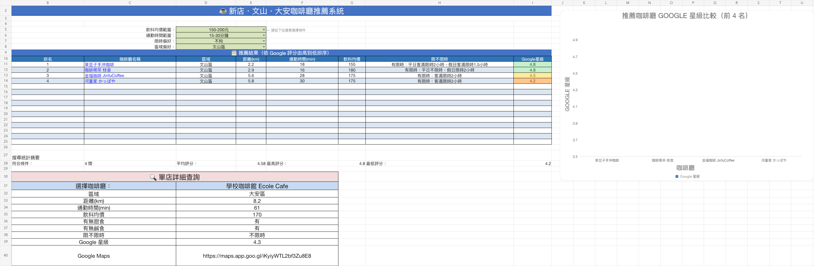
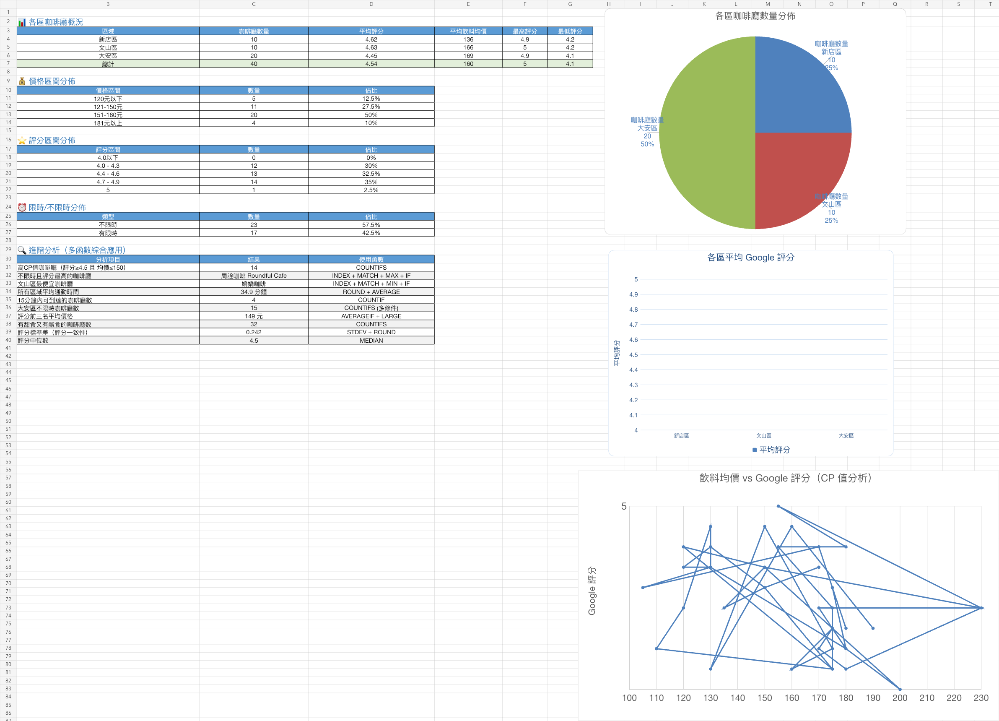

# 新店・文山・大安咖啡廳推薦系統

> **Taipei Cafe Recommender** — an Excel/VBA portfolio project that turns a small cafe dataset into an interactive recommendation and analysis workflow.

這是一個以 Microsoft Excel 與 VBA 製作的互動式咖啡廳推薦工具。使用者可以依照飲料均價、通勤時間、限時偏好與行政區篩選，系統會依 Google 評分排序，顯示推薦結果、單店資訊及統計圖表。



## 問題與目標

咖啡廳資訊常分散在地圖、社群貼文與個人筆記中，不容易同時比較價格、通勤時間及使用限制。這個專案將 40 間咖啡廳整理成一致的資料結構，並用 Excel 建立一個不需要額外安裝應用程式的查詢介面。

## 核心功能

- 依飲料均價、通勤時間、限時偏好與區域進行多條件篩選。
- 依 Google 評分由高至低排序，最多顯示 15 筆結果。
- 點擊咖啡廳名稱即可開啟對應的 Google Maps 頁面。
- 使用條件式格式區分不同評分級距。
- 提供單店詳細查詢、搜尋摘要及動態比較圖表。
- 彙整區域、價格、評分與限時規則的統計分析。



## 技術架構

| 層次 | 技術與責任 |
| --- | --- |
| 資料 | 7 個工作表、40 筆咖啡廳資料、Google Maps 連結 |
| 互動 | Excel 資料驗證下拉選單、表單按鈕、超連結 |
| 自動化 | VBA 篩選、排序、清除狀態、條件式格式與圖表更新 |
| 分析 | VLOOKUP、COUNTIFS、AVERAGEIF、INDEX/MATCH、MAX/IF、MIN/IF、LARGE、STDEV、MEDIAN |
| 品質 | Python contract tests 直接檢查 `.xlsm`、OOXML 與內嵌 VBA 的一致性 |

VBA 原始碼另外匯出在 [`src/vba/CafeRecommender.bas`](src/vba/CafeRecommender.bas)，方便直接閱讀與版本比較；實際可操作檔案則保留在 [`workbook/taipei-cafe-recommender.xlsm`](workbook/taipei-cafe-recommender.xlsm)。

## 使用方式

1. 下載 `workbook/taipei-cafe-recommender.xlsm`。
2. 使用桌面版 Microsoft Excel 開啟；Excel 網頁版不支援執行 VBA。
3. 確認檔案來源可信後，按下「啟用內容」允許巨集執行。
4. 前往「儀表板」，選擇篩選條件並按下搜尋按鈕。

## 安全性

- 活頁簿開啟時不會自動執行巨集。
- VBA 只讀寫本活頁簿、更新圖表及建立資料中既有的 Google Maps 超連結。
- 不會執行 Shell／PowerShell、不會下載檔案，也不會讀取帳號、密碼或本機文件。
- Office 作者中繼資料已從作品集版本移除；作品歸屬由 Git commit 與 GitHub 帳號呈現。
- 靜態掃描沒有偵測到 VBA Stomping；掃描器僅將 Office 文件模組必要的十六進位 CLSID 標成一般性提示，追蹤的 VBA 原始碼本身沒有混淆或十六進位字串。

## 限制與資料說明

- 店家資料是 **2026-04 的課程專案快照**；價格、Google 評分、營業狀況及限時規則可能已改變，使用前應再次確認。
- 原始專案沒有記錄通勤時間的固定起點，因此通勤時間只適合用於展示篩選邏輯，不應視為任何使用者的即時路線估算。
- 資料範圍只有新店、文山與大安三區，不代表完整的「大台北」咖啡廳名錄。
- 目前提供靜態截圖；互動流程需在桌面版 Microsoft Excel 中操作。

更完整的資料使用說明請見 [`DATA_NOTICE.md`](DATA_NOTICE.md)。

## 測試

```bash
python -m pip install -r requirements-dev.txt
python -m unittest discover -v
```

測試會驗證公式範圍、條件查找、作者中繼資料、VBA 安全行為，以及內嵌 VBA 是否與 Git 追蹤的 `.bas` 完全一致。

## 作者

Portfolio project by [@Hunter20041004](https://github.com/Hunter20041004).
